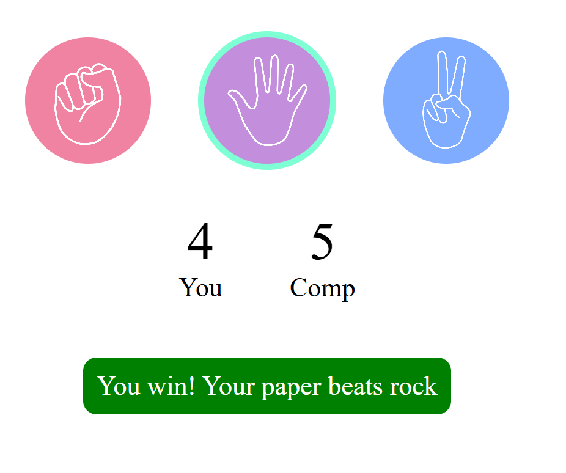
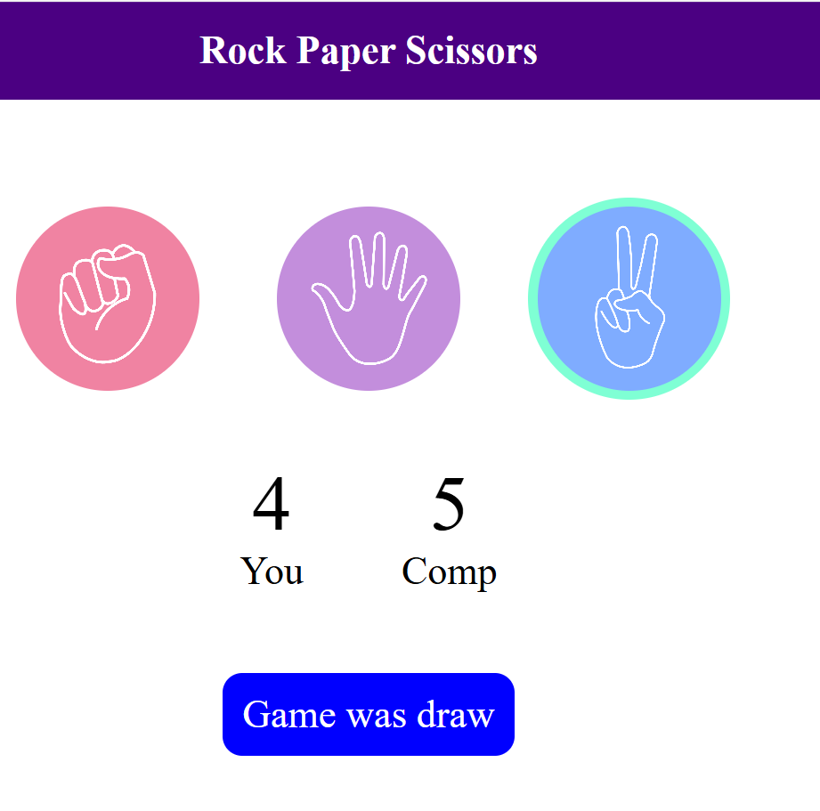
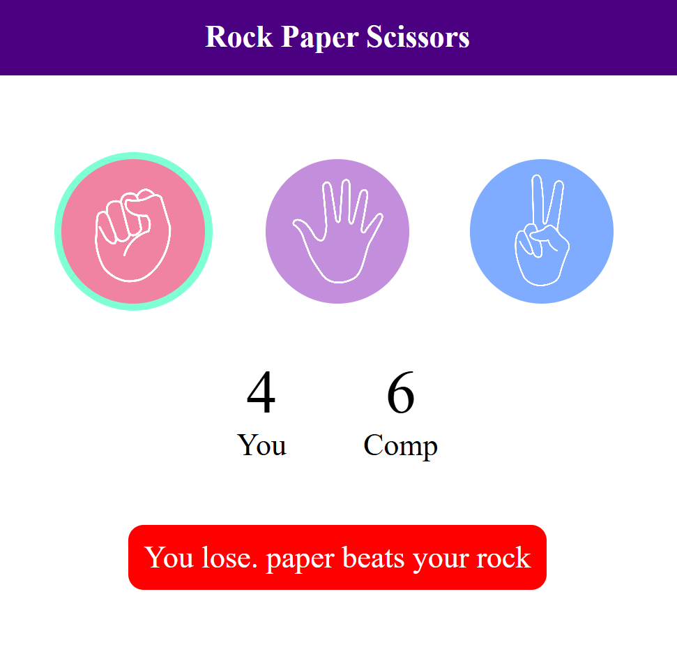

# Rock Paper Scissors

A lightweight **vanilla HTML/CSS/JS** web game. Play against the computer, see live scores, and get instant win/draw/lose feedback.

[](https://Sarishti845.github.io/Rock-Paper-Scissors/)


## 🔗 Live Demo
[https://Sarishti845.github.io/Rock-Paper-Scissors/](https://Sarishti845.github.io/Rock-Paper-Scissors/)


## ✨ Features
- Three choices: **Rock**, **Paper**, **Scissors**
- Random computer move & instant result banner
- **Scoreboard** (You vs Computer)
- Clean, responsive UI — no frameworks

## 🖼️ Screenshots

<p align="center">
  
</p>
<p align="center">
  
</p>
<p align="center">
  
</p>

## 🧰 Tech Stack
- **HTML** for structure  
- **CSS** for styling  
- **JavaScript** for game logic

## 🚀 Run Locally
1. Download or clone this repository.
2. Open **`index.html`** in your browser (double-click or drag–drop).  
   _No server/build needed._

### Optional: VS Code Live Server
Install **Live Server** → right-click `index.html` → **Open with Live Server**.

## 🎮 How to Play
- Click one of the three icons (Rock/Paper/Scissors).
- Computer picks randomly.
- Banner shows **Win / Lose / Draw** and the **scores** update.

## 🧠 Core Logic (snippet)
```js
function getResult(player, computer) {
  if (player === computer) return "draw";
  const winPairs = { rock: "scissors", paper: "rock", scissors: "paper" };
  return winPairs[player] === computer ? "win" : "lose";
}
📁 Project Structure
pgsql
Copy
Edit
.
├── index.html
├── style.css
├── first.js
├── paper.png
├── rock.png (or rock copy.png)
├── scissors.png
└── assets/
    ├── rps-win.png
    ├── rps-draw.png
    └── rps-lose.png
